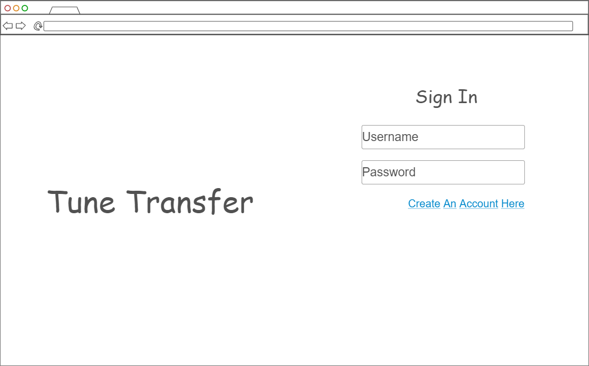
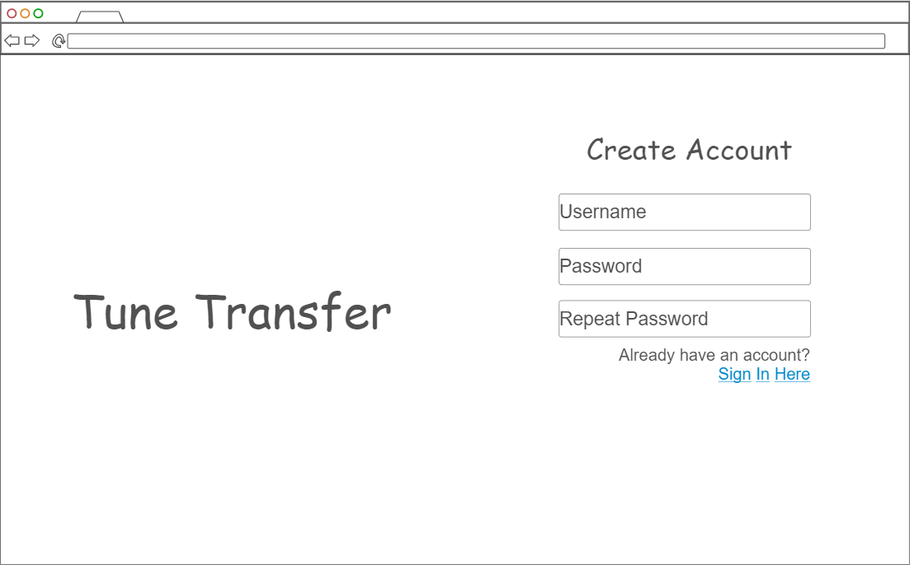
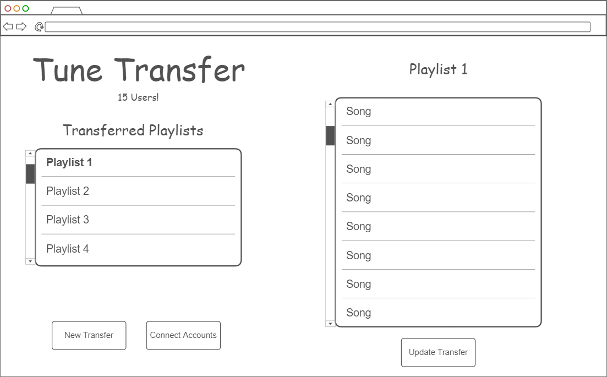
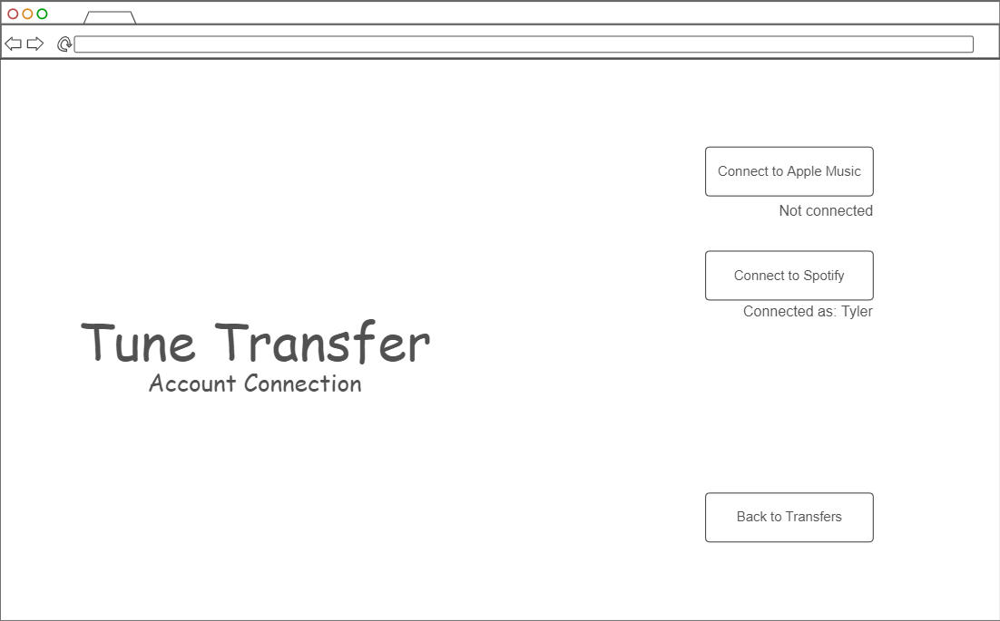

# Startup
Startup Project for CS 260

[Notes for the class](notes.md)

## Startup Specification - TuneTransfer

### What is TuneTransfer?
The goal of TuneTransfer is to make sharing music easier. There are many different music-streaming services like Apple
Music, Spotify, YouTube Music, Amazon Music, and many more. For the sake of simplicity, TuneTransfer will first focus on
Apple Music and Spotify, two of the most popular services out there. TuneTransfer will help you take playlists that you 
have created or listened to on one streaming service and create a copy of that playlist on another streaming service, 
provided one has an account for both streaming services. It will also be able to keep track of said playlists so that
the user can manually update the copied playlist. By doing this, TuneTransfer will allow people who favor or primarily 
use different streaming services to more easily share music with each other.

### Key Features
- Creation of TuneTransfer account and signing in.
- Live count of the number of users of TuneTransfer.
- Ability to connect to Apple Music and Spotify services.
- Ability to select a playlist from a service and transfer it to another service.
- Ability to remember a previous transfer and if the original playlist is updated to manually update the copy on the 
other service.

### Technologies
- **HTML** - Uses correct HTML structure for application. 4 pages: User Creation, Sign In, Playlist Transfers, Account 
Connection.
- **CSS** - Application will have styling that makes it readable and enjoyable to look at.
- **JavaScript** - Provides functionality for creating users, signing in, displaying already transferred playlists/songs,
and backend endpoint calls.
- **React** - Single page application. Page will change based on the user's action.
- **Service** - Backend service endpoints for:
  - Retrieving playlist/song metadata, interpreting it, and creating a playlist for a different service.
  - Retrieving information from the DB
  - Making calls to [Apple](https://developer.apple.com/documentation/AppleMusicAPI) and [Spotify](https://developer.spotify.com/documentation/web-api) API's
- **DB/Login** - Store users, service account connections, and playlist transfers.
- **WebSocket** - As each user creates a user account, it will update the live count.

### Sketches

## Deliverables

### HTML Deliverable
For this deliverable I built out the structure of my application using HTML.

- [x] **HTML pages** - 4 HTML pages that represent the ability to log in, register, view and make transfers, and connect music accounts.
- [x] **Links** - The login page links to the register and transfers page. The register page links to the login and transfers page.
The transfers page links to the accounts page. The accounts page links to the transfers page.
- [x] **Text** - All the transferred playlists and songs will be represented in text. Text describes the different music accounts to connect.
- [x] **Images** - I included an image for the logo of my website. I also included Apple Music and Spotify logos in the accounts page.
- [x] **DB/Login** - Input box and submit button for login/registration. The playlists and songs will be retrieved from the database.
- [x] **WebSocket** - The count of registered users will be updated by a WebSocket.
- [x] **3rd Party Services** - 2 Buttons in the accounts page that will make calls to the 3rd party services for Apple Music and Spotify.

## CSS deliverable
For this deliverable I properly styled the application into its final appearance.

- [x] **Header, footer, and main content** - All styled in the body with a color theme.
- [x] **Navigation elements** - I got rid of the bullet points in each element. Added color and styled in horizontal 
direction.
- [x] **Responsive to window resizing** - My app fits well on all window sizes and devices. Some of the elements are 
styled differently depending on the size of the window.
- [x] **Application elements** - Used good spacing in between elements. All elements were colored according to the same
color scheme.
- [x] **Application text content** - Consistent fonts and colors between all the text elements.
- [x] **Application images** - My images have consistent padding and spacing to make them easier to look at. My logo 
image now matches the color scheme as well.

## React deliverable
For this deliverable I used JavaScript and React so that the application completely works for a single user. I also 
added placeholders for future technology.

- [x] **Bundled and transpiled** - done!
- [x] **Components** - Login, Register, Transfers, Accounts.
  - [x] **login** - When you press enter or the login button it takes you to the transfers page.
  - [x] **register** - When you press enter or the register button it takes you to the transfers page.
  - [x] **transfers** - Displays previous transferred playlist and songs. Uses dumby data which will be replaced with 
real data made by future API calls.
  - [x] **accounts** - Has buttons that will connect to the different music accounts. Actual functionality will be implemented
using future API calls.
- [x] **Router** - Routing between login, register, transfers, and accounts components.
- [x] **Hooks** - Using `UseState` to keep track of variables such as username, playlists, songs, and loggedIn.

## Service deliverable

For this deliverable I added backend endpoints that allow for logging in and connecting to Spotify.

- [x] **Node.js/Express HTTP service** - done!
- [x] **Static middleware for frontend** - done!
- [x] **Calls to third party endpoints** - The backend is able to make calls to Spotify APIs. I was going to do Apple Music 
too, but you have to pay to be able to access them, so I just stuck with Spotify.
- [x] **Backend service endpoints** - Placeholders for login/register that stores the current user on the server. 
- [x] **Frontend calls service endpoints** - I did this using the fetch function.

## DB/Login deliverable

For this deliverable I set up the database that allows the storage of users that register/login.

- [x] **MongoDB Atlas database created** - done!
- [x] **Stores data in MongoDB** - done!
- [x] **User registration** - Creates a new account in the database.
- [x] **User Authentication** - Authenticates users when logging in by checking the password stored in the database.
- [x] **Use MongoDB to store credentials** - Stores the user information in the database.
- [x] **Restricts functionality** - You can only access the application functionality after logging in. Uses cookies to
restrict access.