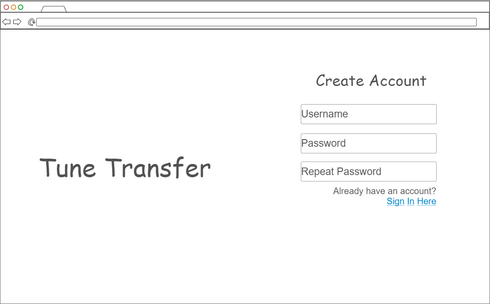
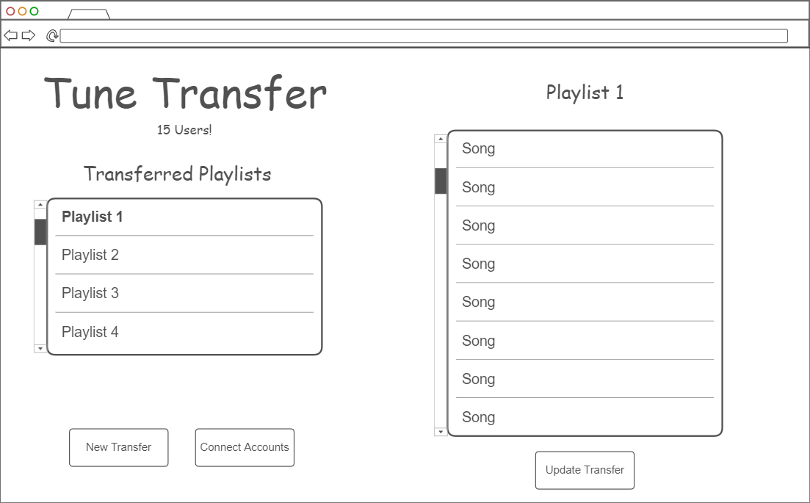
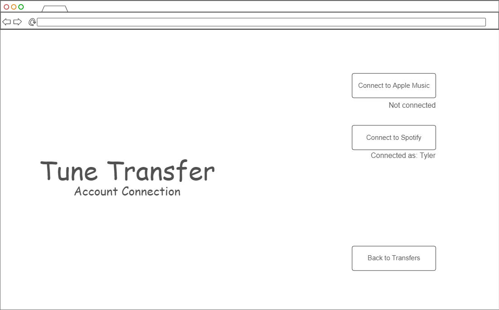

# Startup
Startup Project for CS 260

[Notes for the class](notes.md)

## Startup Specification - TuneTransfer

### What is TuneTransfer?
The goal of TuneTransfer is to make sharing music easier. There are many different music streaming services like Apple
Music, Spotify, Youtube Music, Amazon Music, and many more. For the sake of simplicity, TuneTransfer will first focus on
Apple Music and Spotify, two of the most popular services out there. TuneTransfer will help you take playlists that you 
have created or listened to on one streaming service and create a copy of that playlist on another streaming service, 
provided one has an account for both streaming services. It will also be able to keep track of said playlists so that
the user can manually update the copied playlist. By doing this, TuneTransfer will allow people who favor or primarily 
use different streaming services to more easily share music with each other.

### Key Features
- Creation of TuneTransfer account and signing in.
- Live count of the number of users of TuneTransfer.
- Ability to connect to Apple Music and Spotify services.
- Ability to select a playlist from a service and transfer it to another service.
- Ability to remember a previous transfer and if the original playlist is updated to manually update the copy on the 
other service.

### Technologies
- **HTML** - Uses correct HTML structure for application. 4 pages: User Creation, Sign In, Playlist Transfers, Account 
Connection.
- **CSS** - Application will have styling that makes it readable and enjoyable to look at.
- **JavaScript** - Provides functionality for creating users, signing in, displaying already transferred playlists/songs,
and backend endpoint calls.
- **React** - Single page application. Page will change based on the user's action.
- **Service** - Backend service endpoints for:
  - Retrieving playlist/song metadata, interpreting it, and creating a playlist for a different service.
  - Retrieving information from the DB
  - Making calls to [Apple](https://developer.apple.com/documentation/AppleMusicAPI) and [Spotify](https://developer.spotify.com/documentation/web-api) API's
- **DB/Login** - Store users, service account connections, and playlist transfers.
- **WebSocket** - As each user creates a user account, it will update the live count.

### Sketches

